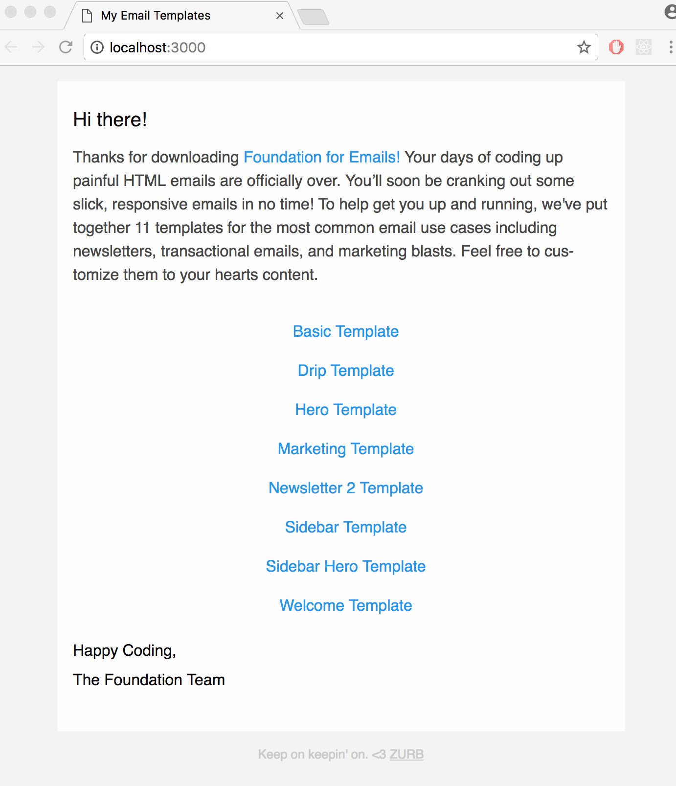

# Верстка адаптивного письма с помощью фреймворка Foundation for Emails

Foundation for Emails современный HTML email-фреймворк для верстки адаптивных писем.

## ZURB Email Stack

ZURB Email Stack включает в себя все необходимые пакеты для верстки:

 * Gulp - инструмент автоматизации процесса сборки веб-приложения
 * Inky HTML - преобразует простые html-тэги в сложную html-таблицу
 * Sass - CSS препроцессор
 * Inlining - inline-стили
 * Image compression - автосжатие изображение с помощью gulp плагина gulp-imagemin,
   сжимает картинки форматов PNG, JPEG, GIF и SVG.
 * BrowserSync - тестовый сервер для перезагрузки
 * Handlebars templates - шаблонизатор позволяющий сократить повторение html-кода

Более подробно о фреймворке написано в [официальной документации](http://foundation.zurb.com/emails/docs/sass-guide.html),
там же можно ознакомиться со списком поддерживаемых приложений в разделе [совместимость](http://foundation.zurb.com/emails/docs/compatibility.html).

## Установка Foundation for Emails
Чтобы использовать Sass версию Foundation for Emails, необходимо установить [Node.js](https://nodejs.org/en/) на компьютер
и пакет менеджер npm. Для установки Foundation for Emails в консоле терминала необходимо прописать команду:

 ```
 $ sudo npm install --global foundation-cli

 ```

 Перейти в папку в которой хранится проект с помощью команды cd, затем запустить в папке проекта эту команду:

 ```
 $ foundation new --framework emails
 ```

 и ответить на вопрос генератора о том, в какую папку сгенерировать код. В данном примере, я указала папку `test`. По оканчанию будет выдан следующий текст:

```
  You're all set!

 ✓ New project folder created.
 ✓ Node modules installed.
 ✓ Bower components installed.

Now run foundation watch while inside the test folder.

```


Для запуска фреймворка и сервера необходимо зайти в новую папку проекта и выполнить команду:

```
 ~/prj/foundation-test/test$ foundation watch
```

В браузере откроется веб-адрес http://localhost:3000/ с готовым email шаблоном:



## Файловая структура проекта

* Файлы в каталоге `src/`:
    * `assets/` - Sass и файлы изображений.
    * `layouts/` - Boilerplate HTML, который обертывает все письма.
    * `pages/` - HTML-файлы для писем.
    * `partials/` - многократные фрагменты HTML, которые могут быть вставлены в страницы.
    * `helpers/` - Любой код, используемый внутри этого помощника, игнорируется Handlebars.
* Файлы в каталоге `dist/`:
    * `index.html` - основной файл со скомпилированным html-кодом
    * `css/app.css` - основной файл со скомпилированным css-кодом

По завершению проекта необходимо выполнить команду в консоли,
все стили пропишутся напрямую в разметку, а проект будет сжат:

```
$ npm run build
```

## Верстка письма

Foundation for Emails имеет 12 колоночную сетку.
Разметка осуществляется в основном с помощью трех тэгов:

* `container` - контейнер
* `row` - контейнер для строк
* `columns` - колонка с контентом

Размер сетки задается с помощью атрибутов `small` и `large`.

Чтобы начать верстать письмо можно воспользоваться [готовым шаблоном от Foundation for Emails](http://foundation.zurb.com/emails/email-templates.html) или верстать самостоятельно по макету.

Необходимо написать тему сообщения в заголовке файла `index.html` используя [Frontmatter](http://assemble.io/docs/YAML-front-matter.html),
он позволяет включать специфичные для страницы переменные в верхней части шаблона,
используя формат YAML:

```

subject: Delivery of vegetables
```

Пример кода письма можно посмотреть в [готовом демо-проекте](https://github.com/NataliaVolik/email-layout-foundation) на Github.
